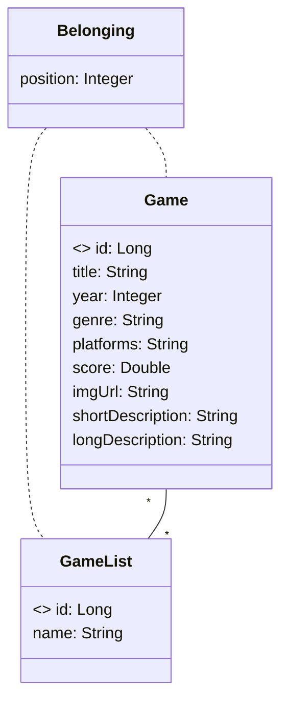

# dslist

```mermaid
classDiagram
  class Game {
    <<pk>> id: Long
    title: String
    year: Integer
    genre: String
    platforms: String
    score: Double
    imgUrl: String
    shortDescription: String
    longDescription: String
  }

  class Belonging {
    position: Integer
  }

  class GameList {
    <<pk>> id: Long
    name: String
  }

  Belonging .. GameList 
  Belonging .. Game
  Game "*" -- "*" GameList
```

Projeto desenvolvido com base na aula (Intensivão Java Spring - Prof. Nélio Alves)
